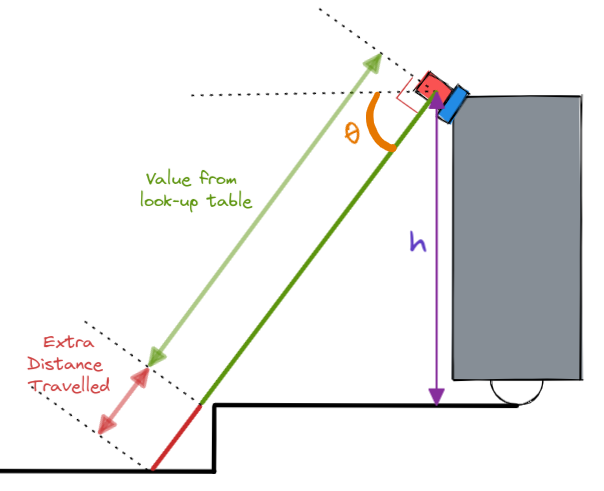
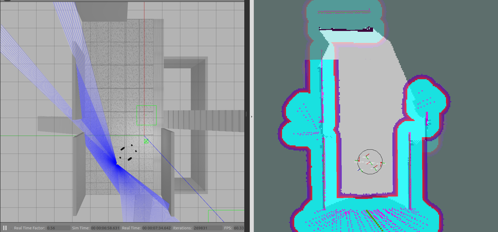
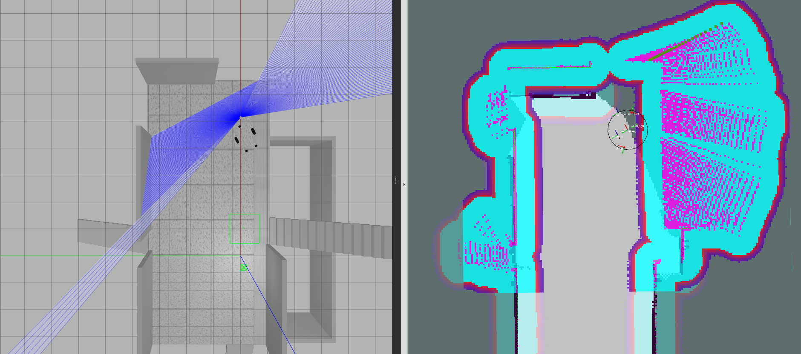

# Introduction

The cliff detector node uses scans from a lidar tilted downwards to detect cliffs. 

# Dependencies
- [ddynamic_reconfigure](https://github.com/pal-robotics/ddynamic_reconfigure)

# Explanation
First, a lookup table of laser scan values are generated, each of these values correspond to the distance travelled by an unobstructed ray from the lidar to the ground plane (at z=0).



The values of the incoming laser scans are compared to the lookup value and the parameter **cliff_threshold_constant** will determine the extra distance travelled by the scan before it is considered a cliff.

IF the scan range is considered a cliff, then it's value will be set as the lookup value, ELSE it will be assigned a value of infinity. This scan is then used to generate the costmap layer *cliff_layer*.
As can be seen in the 2 figures below, the *cliff_layer* is being generated by the green laser scan points. The blue laser visualization in gazebo is that of the cliff lidar tilted downwards.





There is also a failsafe added to warn the user and stop the robot in the event that the lidar is obstructed by a foreign object up close. Should a percentage of the scans (**failsafe_threshold_percentage**) have a value below a distance of **failsafe_threshold_dist**, the failsafe will be activated.

# Quick start

To test the costmap generation from the cliff detection node, simply run:
```
roslaunch cliff_detector cliff_detector_node.launch
```

Subscribe to **"/scan_cliff"** topic of type [sensor_msgs/laserscan] to form the cliff obstacle costmap. And make sure that the **frame_id "cliff_lidar"** is given a static transform to the robot via TF Publisher.

# Parameters
### Physical parameters
- **lidar_height**: [float/meters] Height from base_link
- **lidar_pitch**: [float/degrees] Lidar pitch (along y axis)
- **lidar_resolution**: [float/degrees] Lidar resolution (along y axis)

### Failsafe params
- **failsafe**: [bool] whether to turn on failsafe. This will issue a /cmd_vel command that stops the robot should more than a user-specified percentage of the lidar be obstructed.
- **failsafe_threshold_dist**: [double] (meters) ranges less than this distance is obstructing the lidar
- **failsafe_threshold_percentage**: [float] (percentage) if the percentage of ranges with value less than **"failsafe_threshold_dist"** is exceeded, then lidar is obstructed.
- **failsafe_timeout**: [double] (seconds) Time out from when the lidar is obstructed before failsafe is activated

### Cliff detector params
- **cliff_threshold_constant**: [double] (meters) Distance along the ray below the ground plane to detect as a cliff area

### Segmentation
- **min_seg**: Minimum points required to comprise a segment of cliff points

# Usage
### Topics subscribed
1.  **scan_cliff_raw** [sensor_msgs/laserscan]: Raw lidar scans from the cliff lidar

### Topics published
1. **cliff_thresh_values** [*sensor_msgs/LaserScan*]: "Fake" laser scan used as a visual indication of the ranges (which when exceeded), are considered as negative obstacles.
2. **scan_cliff** [*sensor_msgs/LaserScan*]: The laser scans that show the cliff obstacles and that are used to build the *cliff_layer* costmap
3. **cmd_vel_safety** [*geometry_msgs/Twist*]: To stop the robot when the failsafe is activated.

# To Do
- There is a need to handle the failsafe when the lidar loses connection to the computer. This could be done in the form of listening and parsing the diagnostics message.